# EDID_Formater

> 讓使用者隨意改變EDID格式，更快得到有意義的數據
>
> Created by Ken 2025/06/12

<!-- markdownlint-disable MD033 -->

沒有EDID解析器請看這裡

## 開始之前

取得EDID登錄在windows的reg檔案

1. `win+R` 輸入`regedit`打開登錄檔，找到以下路徑

        電腦\HKEY_LOCAL_MACHINE\SYSTEM\CurrentControlSet\Enum\DISPLAY
    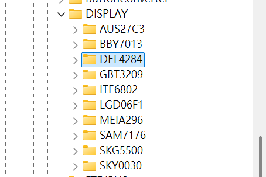

    這些都是顯示器的名稱，前三碼為`製造商ID`，後四碼為`產品名稱`

2. 以`SAM7176`為例，打開後會看到兩個名稱很長的資料夾

    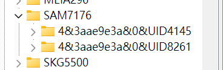

    `UID4145`與`UID8261`，在我的筆電上分別代表HDMI與DP介面，其他電腦我不確定名稱是否相同

3. 點選其中一個資料夾，選擇`Device Parameters`

    你會看到`EDID`出現在右方欄位

    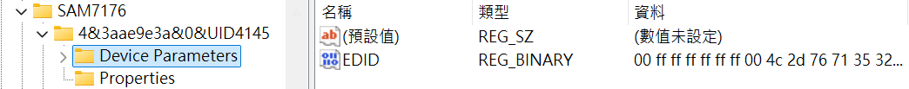

4. 匯出資料，左上方工具列選擇`檔案->匯出`

    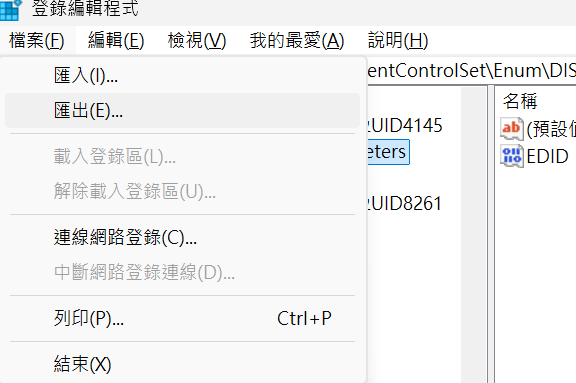

5. 存檔類型選擇`文字檔案*.txt`，避免妳沒有編輯器可以看內容

    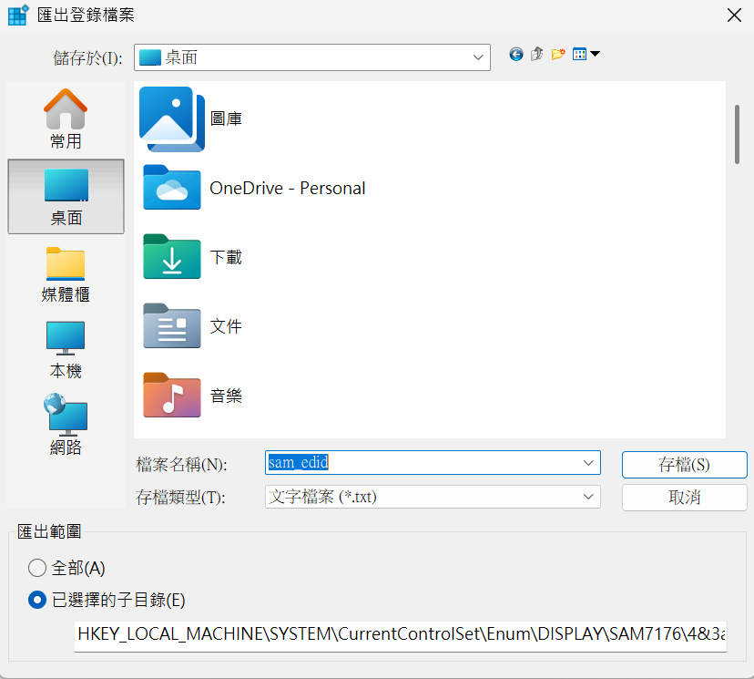

    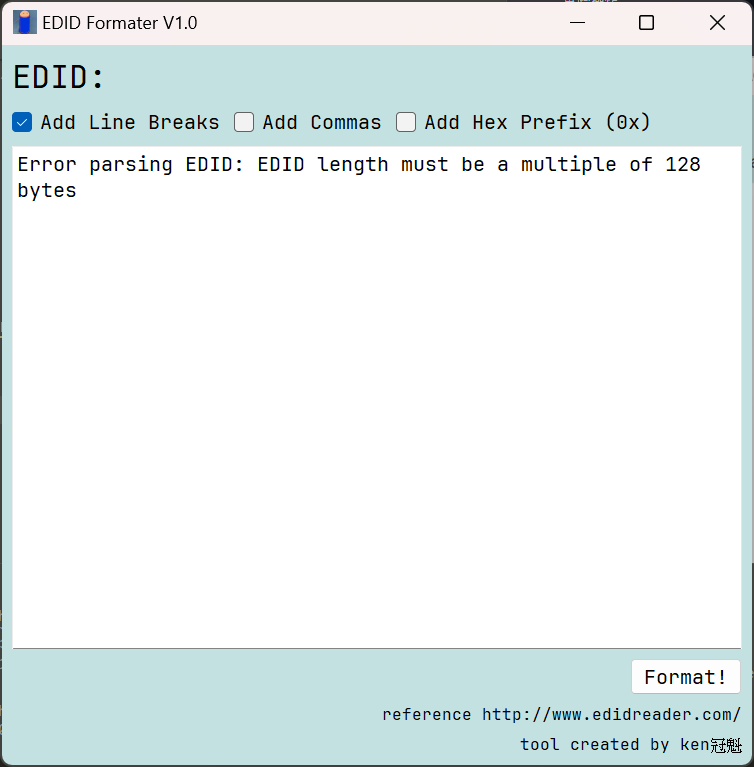
6. 完成EDID原始資料的匯出

    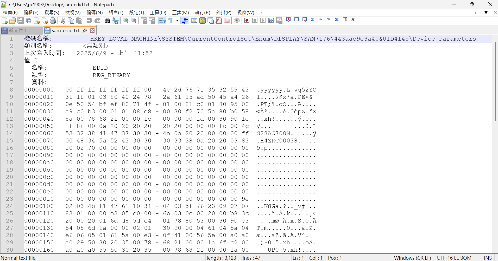

## 編輯EDID原始檔案

上一章節提到如何得到EDID檔案，這一章節告訴你如何將它改成實用的EDID檔案

* 這是一個Samsung顯示器的EDID登錄檔

        機碼名稱:          HKEY_LOCAL_MACHINE\SYSTEM\CurrentControlSet\Enum\DISPLAY\SAM7176\4&3aae9e3a&0&UID4145\Device Parameters
        類別名稱:        <無類別>
        上次寫入時間:   2025/6/9 - 上午 11:52
        值 0
        名稱:            EDID
        類型:            REG_BINARY
        資料:
        00000000   00 ff ff ff ff ff ff 00 - 4c 2d 76 71 35 32 59 43  .ÿÿÿÿÿÿ.L-vq52YC
        00000010   31 1f 01 03 80 40 24 78 - 2a 61 15 ad 50 45 a4 26  1....@$x*a.­PE¤&
        00000020   0e 50 54 bf ef 80 71 4f - 81 00 81 c0 81 80 95 00  .PT¿ï.qO...À....
        00000030   a9 c0 b3 00 01 01 08 e8 - 00 30 f2 70 5a 80 b0 58  ©À³....è.0òpZ.°X
        00000040   8a 00 78 68 21 00 00 1e - 00 00 00 fd 00 30 90 1e  ..xh!......ý.0..
        00000050   ff 8f 00 0a 20 20 20 20 - 20 20 00 00 00 fc 00 4c  ÿ...      ...ü.L
        00000060   53 32 38 41 47 37 30 30 - 4e 0a 20 20 00 00 00 ff  S28AG700N.  ...ÿ
        00000070   00 48 34 5a 52 43 30 30 - 30 33 38 0a 20 20 03 83  .H4ZRC00038.  ..
        00000080   f0 02 70 00 00 00 00 00 - 00 00 00 00 00 00 00 00  ð.p.............
        00000090   00 00 00 00 00 00 00 00 - 00 00 00 00 00 00 00 00  ................
        000000a0   00 00 00 00 00 00 00 00 - 00 00 00 00 00 00 00 00  ................
        000000b0   00 00 00 00 00 00 00 00 - 00 00 00 00 00 00 00 00  ................
        000000c0   00 00 00 00 00 00 00 00 - 00 00 00 00 00 00 00 00  ................
        000000d0   00 00 00 00 00 00 00 00 - 00 00 00 00 00 00 00 00  ................
        000000e0   00 00 00 00 00 00 00 00 - 00 00 00 00 00 00 00 00  ................
        000000f0   00 00 00 00 00 00 00 00 - 00 00 00 00 00 00 00 9e  ................
        00000100   02 03 4b f1 47 61 10 3f - 04 03 5f 76 23 09 07 07  ..KñGa.?.._v# ..
        00000110   83 01 00 00 e3 05 c0 00 - 6b 03 0c 00 20 00 b8 3c  ....ã.À.k... .¸<
        00000120   20 00 20 01 6d d8 5d c4 - 01 78 80 53 00 30 90 c3   . .mØ]Ä.x.S.0.Ã
        00000130   54 05 6d 1a 00 00 02 0f - 30 90 00 04 61 04 5a 04  T.m.....0...a.Z.
        00000140   e6 06 05 01 61 5a 00 e3 - 0f 41 00 56 5e 00 a0 a0  æ...aZ.ã.A.V^.  
        00000150   a0 29 50 30 20 35 00 78 - 68 21 00 00 1a 6f c2 00   )P0 5.xh!...oÂ.
        00000160   a0 a0 a0 55 50 30 20 35 - 00 78 68 21 00 00 1a 00     UP0 5.xh!....
        00000170   00 00 00 00 00 00 00 00 - 00 00 00 00 00 00 00 27  ...............'
        00000180   70 12 79 00 00 03 01 3c - 51 2c 02 88 ff 0e 2f 02  p.y....<Q,..ÿ./.
        00000190   f7 80 1f 00 6f 08 59 00 - 4b 00 07 00 97 e2 00 08  ÷...o.Y.K....â..
        000001a0   ff 09 9f 00 07 80 3f 00 - 9f 05 28 00 02 00 04 00  ÿ ....?...(.....
        000001b0   6f 7e 00 08 7f 07 4f 00 - 07 80 1f 00 37 04 2c 00  o~....O.....7.,.
        000001c0   1e 00 07 00 00 00 00 00 - 00 00 00 00 00 00 00 00  ................
        000001d0   00 00 00 00 00 00 00 00 - 00 00 00 00 00 00 00 00  ................
        000001e0   00 00 00 00 00 00 00 00 - 00 00 00 00 00 00 00 00  ................
        000001f0   00 00 00 00 00 00 00 00 - 00 00 00 00 00 00 7c 90  ..............|.

        機碼名稱:          HKEY_LOCAL_MACHINE\SYSTEM\CurrentControlSet\Enum\DISPLAY\SAM7176\4&3aae9e3a&0&UID4145\Device Parameters\WDF
        類別名稱:        <無類別>
        上次寫入時間:   2025/2/10 - 下午 02:17

* 取得中間的EDID數據，也就是以下這一段資料

        00 ff ff ff ff ff ff 00 - 4c 2d 76 71 35 32 59 43
        31 1f 01 03 80 40 24 78 - 2a 61 15 ad 50 45 a4 26
        0e 50 54 bf ef 80 71 4f - 81 00 81 c0 81 80 95 00
        a9 c0 b3 00 01 01 08 e8 - 00 30 f2 70 5a 80 b0 58
        8a 00 78 68 21 00 00 1e - 00 00 00 fd 00 30 90 1e
        ff 8f 00 0a 20 20 20 20 - 20 20 00 00 00 fc 00 4c
        53 32 38 41 47 37 30 30 - 4e 0a 20 20 00 00 00 ff
        00 48 34 5a 52 43 30 30 - 30 33 38 0a 20 20 03 83
        f0 02 70 00 00 00 00 00 - 00 00 00 00 00 00 00 00
        00 00 00 00 00 00 00 00 - 00 00 00 00 00 00 00 00
        00 00 00 00 00 00 00 00 - 00 00 00 00 00 00 00 00
        00 00 00 00 00 00 00 00 - 00 00 00 00 00 00 00 00
        00 00 00 00 00 00 00 00 - 00 00 00 00 00 00 00 00
        00 00 00 00 00 00 00 00 - 00 00 00 00 00 00 00 00
        00 00 00 00 00 00 00 00 - 00 00 00 00 00 00 00 00
        00 00 00 00 00 00 00 00 - 00 00 00 00 00 00 00 9e
        02 03 4b f1 47 61 10 3f - 04 03 5f 76 23 09 07 07
        83 01 00 00 e3 05 c0 00 - 6b 03 0c 00 20 00 b8 3c
        20 00 20 01 6d d8 5d c4 - 01 78 80 53 00 30 90 c3
        54 05 6d 1a 00 00 02 0f - 30 90 00 04 61 04 5a 04
        e6 06 05 01 61 5a 00 e3 - 0f 41 00 56 5e 00 a0 a0
        a0 29 50 30 20 35 00 78 - 68 21 00 00 1a 6f c2 00
        a0 a0 a0 55 50 30 20 35 - 00 78 68 21 00 00 1a 00
        00 00 00 00 00 00 00 00 - 00 00 00 00 00 00 00 27
        70 12 79 00 00 03 01 3c - 51 2c 02 88 ff 0e 2f 02
        f7 80 1f 00 6f 08 59 00 - 4b 00 07 00 97 e2 00 08
        ff 09 9f 00 07 80 3f 00 - 9f 05 28 00 02 00 04 00
        6f 7e 00 08 7f 07 4f 00 - 07 80 1f 00 37 04 2c 00
        1e 00 07 00 00 00 00 00 - 00 00 00 00 00 00 00 00
        00 00 00 00 00 00 00 00 - 00 00 00 00 00 00 00 00
        00 00 00 00 00 00 00 00 - 00 00 00 00 00 00 00 00
        00 00 00 00 00 00 00 00 - 00 00 00 00 00 00 7c 90

    完成後就可以開始使用格式化工具

<!-- markdownlint-enable MD033 -->

## 介面

* 應用程式圖示

    

* 執行介面

    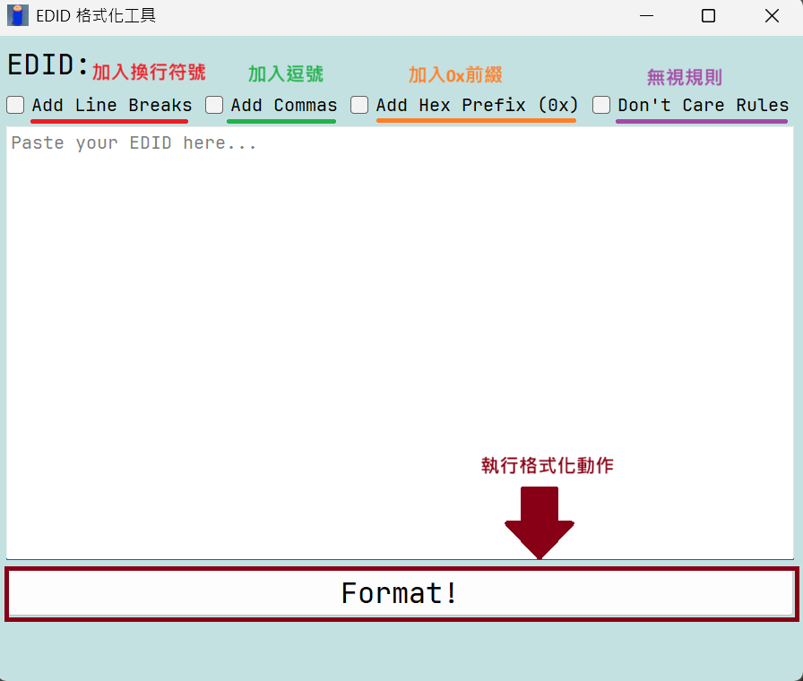

## How to use EDID格式化工具

* 貼上你的EDID，選擇想要的功能，接著按下`Format!`

    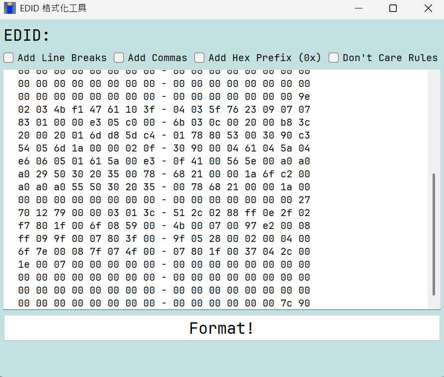

* 完成結果

    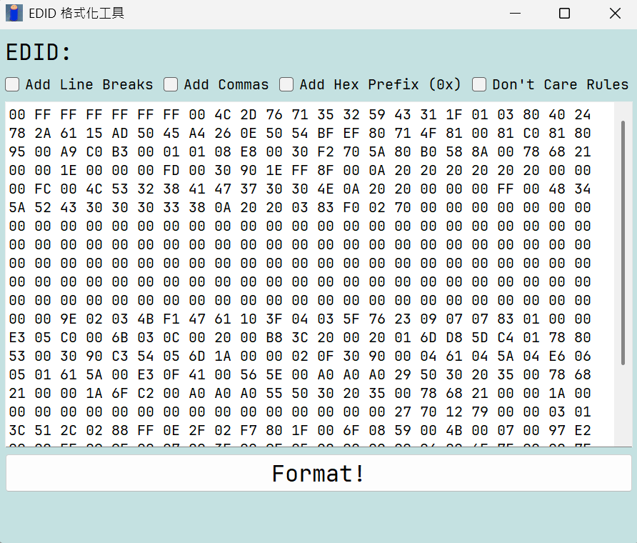

* 現在可以改變換行的字節單位(更新於v1.1)

    每16字節換行

    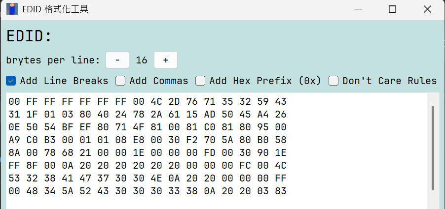

    每8字節換行

    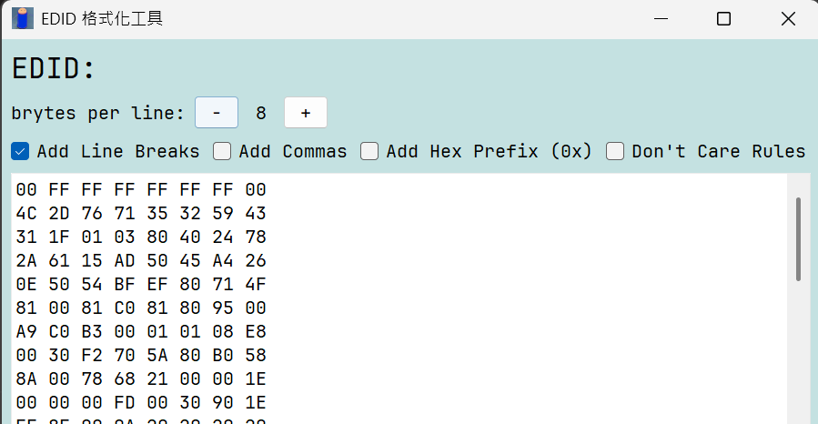

## 可格式化的EDID樣式

* 帶有`0x`前綴
* 帶有`-` `,`標點符號
* 帶有`空格` `換行`命令字元

以上都可以完全忽略，請參考範例

* 帶有所有可忽略的格式EDID

    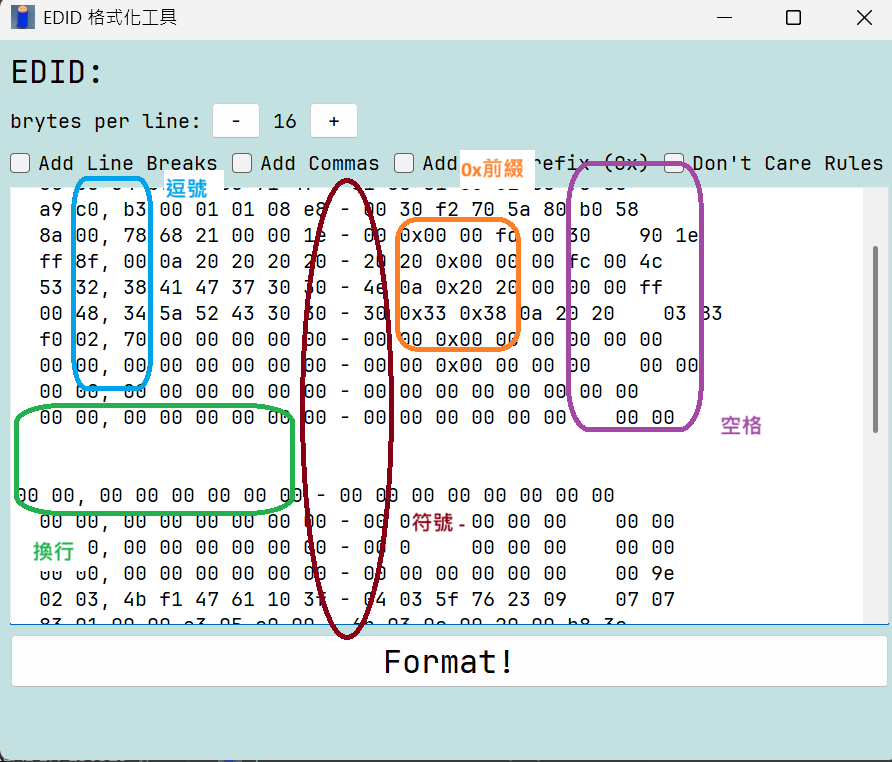

* Format!

    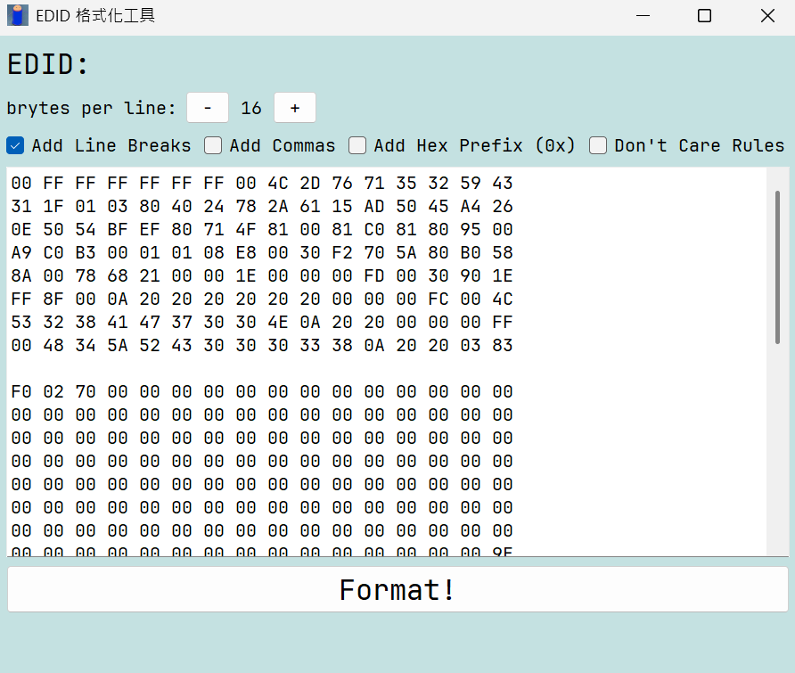
