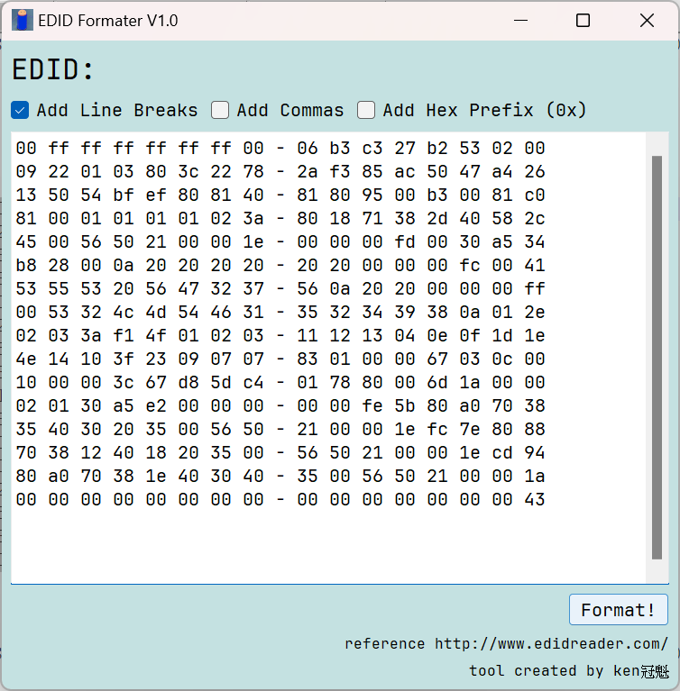
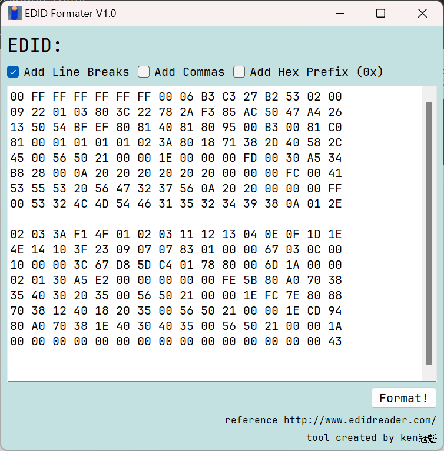
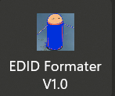
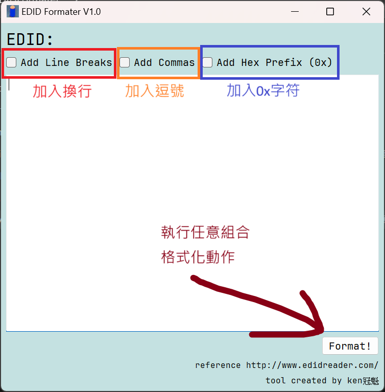
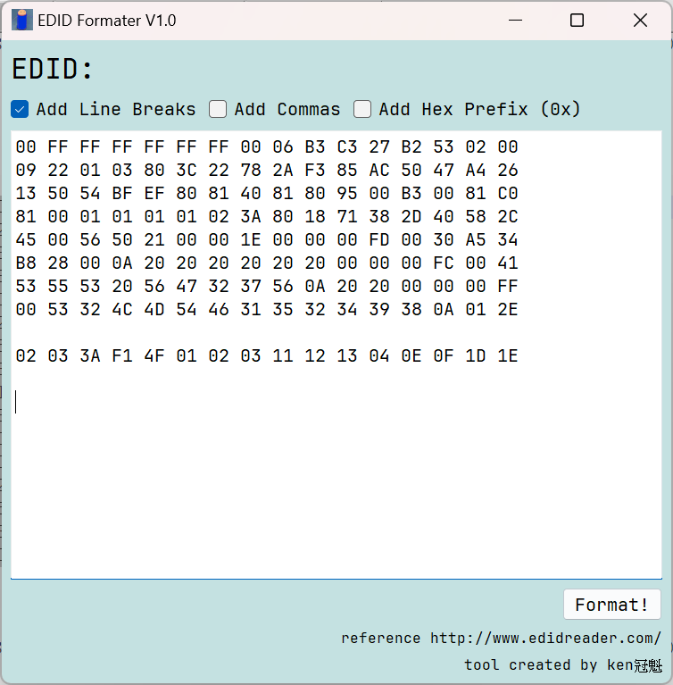
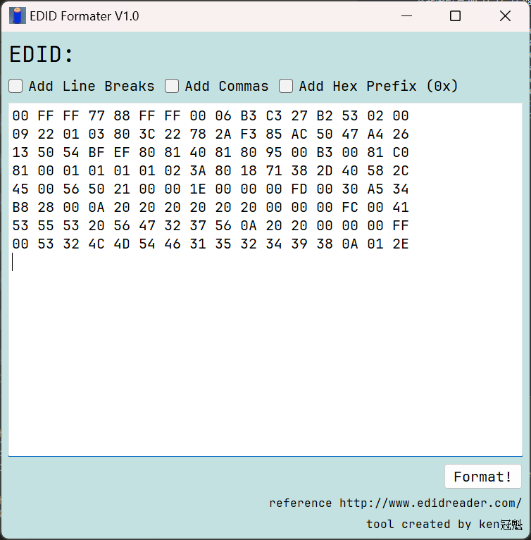
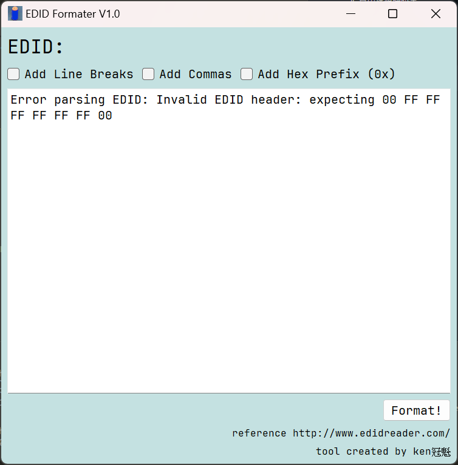

# EDID_Formater

> created by ken冠魁

## 重點整理

1. 使用前，先編輯已複製的內容，可以容忍`0x` `空白字元` `-` `,`等字詞

    比如從regedit得到的EDID

    1. 原始資料

            00000000   00 ff ff ff ff ff ff 00 - 06 b3 c3 27 b2 53 02 00  .ÿÿÿÿÿÿ..³Ã'²S..
            00000010   09 22 01 03 80 3c 22 78 - 2a f3 85 ac 50 47 a4 26  	"...<"x*ó.¬PG¤&
            00000020   13 50 54 bf ef 80 81 40 - 81 80 95 00 b3 00 81 c0  .PT¿ï..@....³..À
            00000030   81 00 01 01 01 01 02 3a - 80 18 71 38 2d 40 58 2c  .......:..q8-@X,
            00000040   45 00 56 50 21 00 00 1e - 00 00 00 fd 00 30 a5 34  E.VP!......ý.0¥4
            00000050   b8 28 00 0a 20 20 20 20 - 20 20 00 00 00 fc 00 41  ¸(..      ...ü.A
            00000060   53 55 53 20 56 47 32 37 - 56 0a 20 20 00 00 00 ff  SUS VG27V.  ...ÿ
            00000070   00 53 32 4c 4d 54 46 31 - 35 32 34 39 38 0a 01 2e  .S2LMTF152498...
            00000080   02 03 3a f1 4f 01 02 03 - 11 12 13 04 0e 0f 1d 1e  ..:ñO...........
            00000090   4e 14 10 3f 23 09 07 07 - 83 01 00 00 67 03 0c 00  N..?#	......g...
            000000a0   10 00 00 3c 67 d8 5d c4 - 01 78 80 00 6d 1a 00 00  ...<gØ]Ä.x..m...
            000000b0   02 01 30 a5 e2 00 00 00 - 00 00 fe 5b 80 a0 70 38  ..0¥â.....þ[. p8
            000000c0   35 40 30 20 35 00 56 50 - 21 00 00 1e fc 7e 80 88  5@0 5.VP!...ü~..
            000000d0   70 38 12 40 18 20 35 00 - 56 50 21 00 00 1e cd 94  p8.@. 5.VP!...Í.
            000000e0   80 a0 70 38 1e 40 30 40 - 35 00 56 50 21 00 00 1a  . p8.@0@5.VP!...
            000000f0   00 00 00 00 00 00 00 00 - 00 00 00 00 00 00 00 43  ...............C    
    2. 修改後

        >[!Tip]
        > 有一些文字編輯器(例如:MS word、Notepad++)支援`Alt+滑鼠左鍵`選取區塊

            00 ff ff ff ff ff ff 00 - 06 b3 c3 27 b2 53 02 00
            09 22 01 03 80 3c 22 78 - 2a f3 85 ac 50 47 a4 26
            13 50 54 bf ef 80 81 40 - 81 80 95 00 b3 00 81 c0
            81 00 01 01 01 01 02 3a - 80 18 71 38 2d 40 58 2c
            45 00 56 50 21 00 00 1e - 00 00 00 fd 00 30 a5 34
            b8 28 00 0a 20 20 20 20 - 20 20 00 00 00 fc 00 41
            53 55 53 20 56 47 32 37 - 56 0a 20 20 00 00 00 ff
            00 53 32 4c 4d 54 46 31 - 35 32 34 39 38 0a 01 2e
            02 03 3a f1 4f 01 02 03 - 11 12 13 04 0e 0f 1d 1e
            4e 14 10 3f 23 09 07 07 - 83 01 00 00 67 03 0c 00
            10 00 00 3c 67 d8 5d c4 - 01 78 80 00 6d 1a 00 00
            02 01 30 a5 e2 00 00 00 - 00 00 fe 5b 80 a0 70 38
            35 40 30 20 35 00 56 50 - 21 00 00 1e fc 7e 80 88
            70 38 12 40 18 20 35 00 - 56 50 21 00 00 1e cd 94
            80 a0 70 38 1e 40 30 40 - 35 00 56 50 21 00 00 1a
            00 00 00 00 00 00 00 00 - 00 00 00 00 00 00 00 43

    3. Format it!

        > 1. 執行前
            
        > 1. 執行後 
            

## Usage

1. 點開執行檔 EDID Formater V1.0.exe

    

2. 功能如圖所示，try it!
    

3. 可格式化的文字範例

    1. 從`EDID_Reader_Pro_Master`/`完整檢視`最底部 or 點選`匯出EDID`取得EDID

            00 FF FF FF FF FF FF 00 4D D9 03 C4 01 01 01 01
            01 19 01 03 80 6C 3D 78 0A 0D C9 A0 57 47 98 27
            12 48 4C 21 08 00 81 80 A9 C0 71 4F B3 00 01 01
            01 01 01 01 01 01 02 3A 80 18 71 38 2D 40 58 2C
            45 00 3D 62 42 00 00 1E 01 1D 00 72 51 D0 1E 20
            6E 28 55 00 3D 62 42 00 00 1E 00 00 00 FC 00 53
            4F 4E 59 20 54 56 20 20 2A 30 32 0A 00 00 00 FD
            00 30 3E 0E 46 1E 00 0A 20 20 20 20 20 20 01 AD
            02 03 42 F0 57 5D 5E 5F 62 1F 10 14 05 13 04 20
            22 3C 3E 12 16 03 07 11 15 02 06 01 29 0D 7F 07
            15 07 50 3D 07 BC 83 0F 00 00 6E 03 0C 00 40 00
            B8 3C 2F 00 80 01 02 03 04 E2 00 F9 E5 0E 60 61
            65 66 01 1D 80 18 71 1C 16 20 58 2C 25 00 3D 62
            42 00 00 9E 00 00 00 00 00 00 00 00 00 00 00 00
            00 00 00 00 00 00 00 00 00 00 00 00 00 00 00 00
            00 00 00 00 00 00 00 00 00 00 00 00 00 00 00 5B
    2. 頭很鐵使用regedit匯出EDID時，自動忽略`-`字樣

            00 ff ff ff ff ff ff 00 - 06 b3 c3 27 b2 53 02 00 
            09 22 01 03 80 3c 22 78 - 2a f3 85 ac 50 47 a4 26 
            13 50 54 bf ef 80 81 40 - 81 80 95 00 b3 00 81 c0 
            81 00 01 01 01 01 02 3a - 80 18 71 38 2d 40 58 2c 
            45 00 56 50 21 00 00 1e - 00 00 00 fd 00 30 a5 34 
            b8 28 00 0a 20 20 20 20 - 20 20 00 00 00 fc 00 41 
            53 55 53 20 56 47 32 37 - 56 0a 20 20 00 00 00 ff 
            00 53 32 4c 4d 54 46 31 - 35 32 34 39 38 0a 01 2e 
            02 03 3a f1 4f 01 02 03 - 11 12 13 04 0e 0f 1d 1e 
            4e 14 10 3f 23 09 07 07 - 83 01 00 00 67 03 0c 00 
            10 00 00 3c 67 d8 5d c4 - 01 78 80 00 6d 1a 00 00 
            02 01 30 a5 e2 00 00 00 - 00 00 fe 5b 80 a0 70 38 
            35 40 30 20 35 00 56 50 - 21 00 00 1e fc 7e 80 88 
            70 38 12 40 18 20 35 00 - 56 50 21 00 00 1e cd 94 
            80 a0 70 38 1e 40 30 40 - 35 00 56 50 21 00 00 1a 
            00 00 00 00 00 00 00 00 - 00 00 00 00 00 00 00 43 
    3. 超過2個page的EDID也可以

            00 FF FF FF FF FF FF 00 10 AC 84 42 55 30 32 31 
            27 21 01 03 80 47 28 78 EA 1E 75 AF 4F 42 A7 24 
            0F 50 54 A5 4B 00 71 4F 81 00 81 80 A9 40 B3 00 
            D1 C0 D1 00 A9 C0 08 E8 00 30 F2 70 5A 80 B0 58 
            8A 00 C4 8F 21 00 00 1E 00 00 00 FF 00 32 58 44 
            4B 38 50 33 0A 20 20 20 20 20 00 00 00 FC 00 44 
            45 4C 4C 20 47 33 32 32 33 51 0A 20 00 00 00 FD 
            00 30 90 1E FF 3C 00 0A 20 20 20 20 20 20 03 6C 
            F0 02 70 00 00 00 00 00 00 00 00 00 00 00 00 00 
            00 00 00 00 00 00 00 00 00 00 00 00 00 00 00 00 
            00 00 00 00 00 00 00 00 00 00 00 00 00 00 00 00 
            00 00 00 00 00 00 00 00 00 00 00 00 00 00 00 00 
            00 00 00 00 00 00 00 00 00 00 00 00 00 00 00 00 
            00 00 00 00 00 00 00 00 00 00 00 00 00 00 00 00 
            00 00 00 00 00 00 00 00 00 00 00 00 00 00 00 00 
            00 00 00 00 00 00 00 00 00 00 00 00 00 00 00 9E 
            02 03 5A F1 4E 61 60 3F 10 1F 5F 5E 5D 22 04 13 
            12 03 01 23 09 07 07 83 01 00 00 6D 03 0C 00 10 
            00 38 3C 20 00 60 01 02 03 6D D8 5D C4 01 78 88 
            33 0E 30 90 C3 34 14 6D 1A 00 00 02 0B 30 90 E6 
            04 73 14 73 2F E3 05 C3 01 E6 06 05 01 73 73 21 
            E2 00 D5 E3 0E 76 75 E2 0F 03 86 6F 80 A0 70 38 
            40 40 30 20 35 00 C4 8F 21 00 00 1A 6F C2 00 A0 
            A0 A0 55 50 30 20 35 00 C4 8F 21 00 00 1E 00 63 
            70 12 79 03 00 03 01 64 47 E8 01 04 FF 0E 4F 00 
            07 80 1F 00 6F 08 36 00 28 00 07 00 D0 A3 01 04 
            FF 0E 4F 00 07 80 1F 00 6F 08 7E 00 70 00 07 00 
            FA E6 00 04 FF 09 9F 00 4F 80 1F 00 9F 05 45 00 
            3D 00 04 00 59 87 00 04 7F 07 9F 00 2F 80 1F 00 
            37 04 4C 00 02 00 04 00 55 5E 00 04 FF 09 9F 00 
            2F 80 1F 00 9F 05 28 00 02 00 04 00 00 00 00 00 
            00 00 00 00 00 00 00 00 00 00 00 00 00 00 0D 90

    4. 沒有換行也沒關係

            00 FF FF FF FF FF FF 00 10 AC 84 42 55 30 32 31 27 21 01 03 80 47 28 78 EA 1E 75 AF 4F 42 A7 24 0F 50 54 A5 4B 00 71 4F 81 00 81 80 A9 40 B3 00 D1 C0 D1 00 A9 C0 08 E8 00 30 F2 70 5A 80 B0 58 8A 00 C4 8F 21 00 00 1E 00 00 00 FF 00 32 58 44 4B 38 50 33 0A 20 20 20 20 20 00 00 00 FC 00 44 45 4C 4C 20 47 33 32 32 33 51 0A 20 00 00 00 FD 00 30 90 1E FF 3C 00 0A 20 20 20 20 20 20 03 6C F0 02 70 00 00 00 00 00 00 00 00 00 00 00 00 00 00 00 00 00 00 00 00 00 00 00 00 00 00 00 00 00 00 00 00 00 00 00 00 00 00 00 00 00 00 00 00 00 00 00 00 00 00 00 00 00 00 00 00 00 00 00 00 00 00 00 00 00 00 00 00 00 00 00 00 00 00 00 00 00 00 00 00 00 00 00 00 00 00 00 00 00 00 00 00 00 00 00 00 00 00 00 00 00 00 00 00 00 00 00 00 00 00 00 00 00 00 00 00 00 00 00 00 00 00 00 00 9E 02 03 5A F1 4E 61 60 3F 10 1F 5F 5E 5D 22 04 13 12 03 01 23 09 07 07 83 01 00 00 6D 03 0C 00 10 00 38 3C 20 00 60 01 02 03 6D D8 5D C4 01 78 88 33 0E 30 90 C3 34 14 6D 1A 00 00 02 0B 30 90 E6 04 73 14 73 2F E3 05 C3 01 E6 06 05 01 73 73 21 E2 00 D5 E3 0E 76 75 E2 0F 03 86 6F 80 A0 70 38 40 40 30 20 35 00 C4 8F 21 00 00 1A 6F C2 00 A0 A0 A0 55 50 30 20 35 00 C4 8F 21 00 00 1E 00 63 70 12 79 03 00 03 01 64 47 E8 01 04 FF 0E 4F 00 07 80 1F 00 6F 08 36 00 28 00 07 00 D0 A3 01 04 FF 0E 4F 00 07 80 1F 00 6F 08 7E 00 70 00 07 00 FA E6 00 04 FF 09 9F 00 4F 80 1F 00 9F 05 45 00 3D 00 04 00 59 87 00 04 7F 07 9F 00 2F 80 1F 00 37 04 4C 00 02 00 04 00 55 5E 00 04 FF 09 9F 00 2F 80 1F 00 9F 05 28 00 02 00 04 00 00 00 00 00 00 00 00 00 00 00 00 00 00 00 00 00 00 00 0D 90

## 何時會出現錯誤

1. 位元組數必須為128 Bytes(1 block page)的倍數
    1. 比如這樣，第二個block有缺少內容(不足128倍數)

            00 FF FF FF FF FF FF 00 06 B3 C3 27 B2 53 02 00 
            09 22 01 03 80 3C 22 78 2A F3 85 AC 50 47 A4 26 
            13 50 54 BF EF 80 81 40 81 80 95 00 B3 00 81 C0 
            81 00 01 01 01 01 02 3A 80 18 71 38 2D 40 58 2C 
            45 00 56 50 21 00 00 1E 00 00 00 FD 00 30 A5 34 
            B8 28 00 0A 20 20 20 20 20 20 00 00 00 FC 00 41 
            53 55 53 20 56 47 32 37 56 0A 20 20 00 00 00 FF 
            00 53 32 4C 4D 54 46 31 35 32 34 39 38 0A 01 2E 

            02 03 3A F1 4F 01 02 03 11 12 13 04 0E 0F 1D 1E 
    2. 會出現錯誤訊息

        Error parsing EDID: EDID length must be a multiple of 128 bytes

    實際操作

    1. 執行前

        
    2. 執行後

        

2. 簡單的header判讀

    1. 起始8位元判讀(必定要00 FF FF FF FF FF FF 00)

        將起始改為`00 ff ff 77 88 ff ff 00`

            00 ff ff 77 88 ff ff 00 - 06 b3 c3 27 b2 53 02 00
            09 22 01 03 80 3c 22 78 - 2a f3 85 ac 50 47 a4 26
            13 50 54 bf ef 80 81 40 - 81 80 95 00 b3 00 81 c0
            81 00 01 01 01 01 02 3a - 80 18 71 38 2d 40 58 2c
            45 00 56 50 21 00 00 1e - 00 00 00 fd 00 30 a5 34
            b8 28 00 0a 20 20 20 20 - 20 20 00 00 00 fc 00 41
            53 55 53 20 56 47 32 37 - 56 0a 20 20 00 00 00 ff
            00 53 32 4c 4d 54 46 31 - 35 32 34 39 38 0a 01 2e
            
    2. 會出現錯誤訊息

        Error parsing EDID: Invalid EDID header: expecting 00 FF FF FF FF FF FF 00

    實際操作

    1. 執行前

        

    2. 執行後

        
